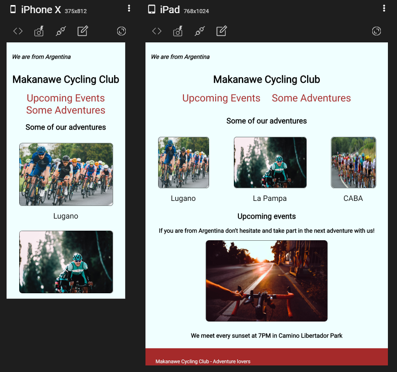

# Responsive Club Website
## Cycling club
### [You can see the project here]()

## **Overview**

## **Features and Objectives**
* A responsive website for 
* The project should demonstrate many of the responsive design tools: media querys, responsive units, etc.
* The page topic should be about a club.

## **Built with**
* CSS3 - Responsive Tools (Media Query, Responsive Units, etc.)
* HTML5 - Semantic

## **Others Tools Used**
* Git
* GitHub
* Visual Studio Code & Bash Shell Terminal